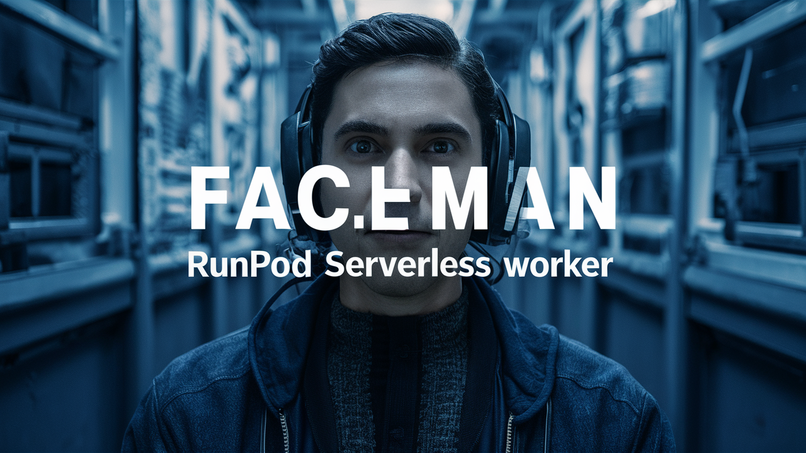

# RunPod Serverless GFPGAN FaceMan Worker



This project allows users to install FaceMan, a GFPGAN AI face enhancement model that enhances faces in video, on RunPod serverless platform.

## Docker image

Docker image available at: [Docker Hub](https://hub.docker.com/repository/docker/drvpn/runpod_serverless_faceman_worker)

## Environment Variables

To run this application on RunPod serverless, you need to set the following environment variables:

- `BUCKET_ENDPOINT_URL`: The endpoint URL of your S3-compatible storage.
- `BUCKET_ACCESS_KEY_ID`: The access key ID for your S3-compatible storage.
- `BUCKET_SECRET_ACCESS_KEY`: The secret access key for your S3-compatible storage.

These variables are required to store and host the enhanced MP4 video files.

## Running on RunPod Serverless

### 1. `Clone the Repository`

```sh
git clone https://github.com/drvpn/runpod_serverless_faceman_worker.git
cd runpod_serverless_faceman_worker
```

2. `Build and Push Docker Image`
   - Follow RunPod's documentation to build and push your Docker image to a container registry.

3. `Deploy on RunPod`
   - Go to RunPod's dashboard and create a new serverless function.
   - Use the Docker image you pushed to your container registry.
   - Set the environment variables: `BUCKET_ENDPOINT_URL`, `BUCKET_ACCESS_KEY_ID`, `BUCKET_SECRET_ACCESS_KEY`.

4. `Invoke the Function`

You can invoke the function with a JSON payload specifying the input video URL. Here is an example:

```sh
{
  "input": {
    "input_video_url": "https://www.example.com/myInputVideo.mp4"
  }
}
```

Use RunPod's interface or an HTTPS client (i.e. Postman) to send this payload to the deployed function.

# Input
- `video_url`: The video you want to enhance (required)

## Example return value
```sh
{
  "delayTime": 789,
  "executionTime": 16608,
  "id": "your-unique-id-will-be-here",
  "output": {
    "output_video_url": "https://mybucket.nyc3.digitaloceanspaces.com/Enhanced_GFPGAN/enhanced_2024_06_14_13.14.11.mp4"
  },
  "status": "COMPLETED"
}
```

# Handler Explanation

The `handler.py` script orchestrates the following tasks:

- Maps a network volume to store checkpoints (if available).
- Downloads and caches model checkpoints if not already present.
- Enhances faces on each video frame and uses them to generate the enhanced video file
- Uploads the generated video file to S3-compatible storage and returns the public URL.

## Contributing

Contributions are welcome! Please open an issue or submit a pull request.

## License

This project is licensed under the MIT License.

